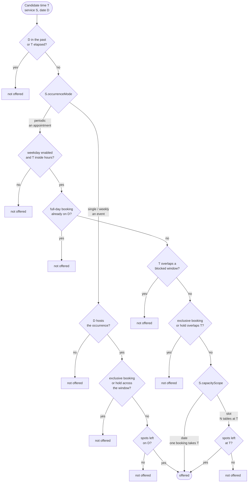
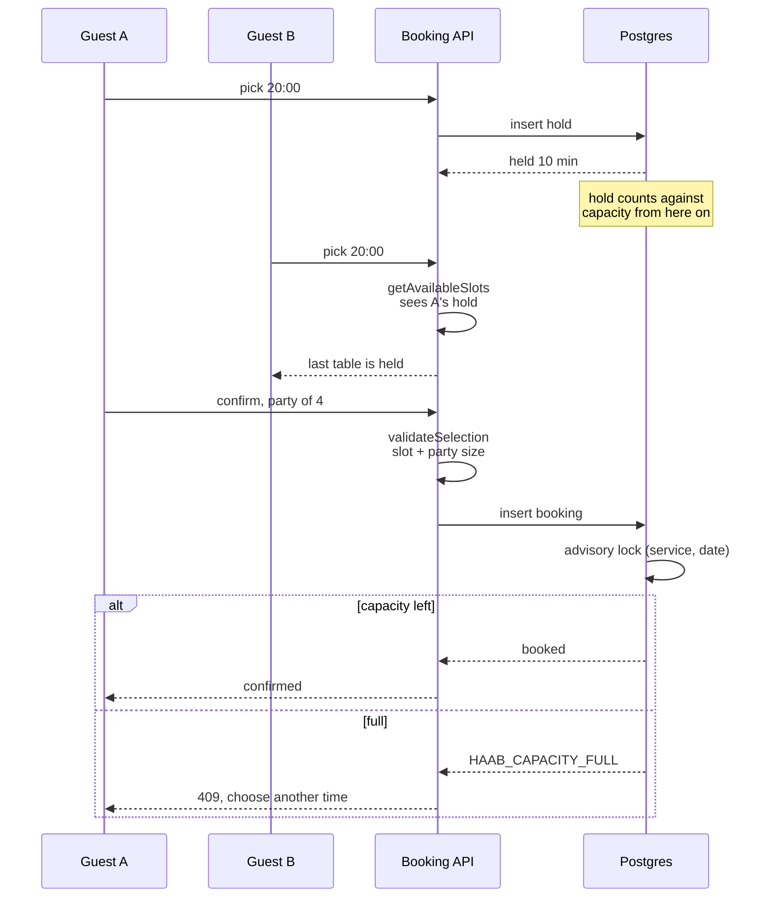
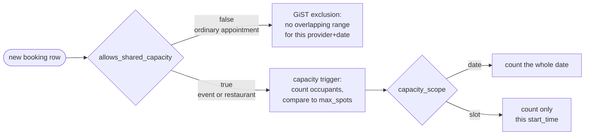

# The booking engine

How a time becomes bookable, and who has the final say when two people want it
at once. The prose lives in [`docs/booking-process.md`](booking-process.md); this
page is the mechanism.

## What removes a candidate slot

Every bookable time starts as a candidate on the grid and survives a series of
tests. Which tests apply depends on how the service is scheduled, and — new with
restaurants — whether its capacity is spent per date or per slot.

Two edges carry most of the meaning.

**"Exclusive booking or hold"** is the filter that makes shared capacity work. A
booking written against a capacity-bearing service is marked shared, and shared
rows never block anything — so a restaurant's dining room and terrace hold
separate counts, and twelve parties can hold 20:00. This mirrors the database
exactly, where shared rows sit outside the overlap constraint.

**`capacityScope`** decides what `getSpotsLeft` counts. Under `date` it counts
every booking for the service on that date, which is right for an event with one
window per date. Under `slot` it counts only bookings at that start time, so
20:00 and 21:30 fill independently.

## Who wins when two people want the last table

The app's availability check narrows the window; it never closes it. Two
requests can both pass it, so the database is the authority — the app check
exists to avoid offering a time that is already gone, not to enforce it.

The lock is taken per `(service_id, date)`, so two confirmations for the same
night serialise even when they are for different seatings. That is coarser than
strictly necessary and deliberately so: restaurant write volume is low, and a
narrower lock buys concurrency the product does not need.

## Which constraint enforces which service

The database applies one of two mechanisms per row, chosen by the
`allows_shared_capacity` flag a trigger derives from the provider's vertical and
the service's `max_spots`.

A shared row is omitted from the GiST index entirely, which is why it neither
conflicts with another booking nor causes one. The app's availability rules are
written to reach the same conclusion, so a time hidden by the UI and a time
rejected by the database are the same set.

## Where the code lives

| Concern | File |
| --- | --- |
| Slot generation, spots, day shading | `lib/availability.ts` |
| Server-side validation before a write | `lib/supabase/bookings.ts` (`validateSelection`) |
| Hold lifecycle | `lib/holds.ts`, `lib/supabase/bookings.ts` |
| Public flow steps | `lib/booking-flow-machine.ts` |
| Overlap and capacity enforcement | `supabase/migrations/20260803071013_*.sql`, `20260814120000_*.sql` |

The availability functions are pure and run in both places: the server validates
a write with them, and `useModuleStore` runs them against local bookings, so an
offline page reaches the same answer as the server for the data it can see.
